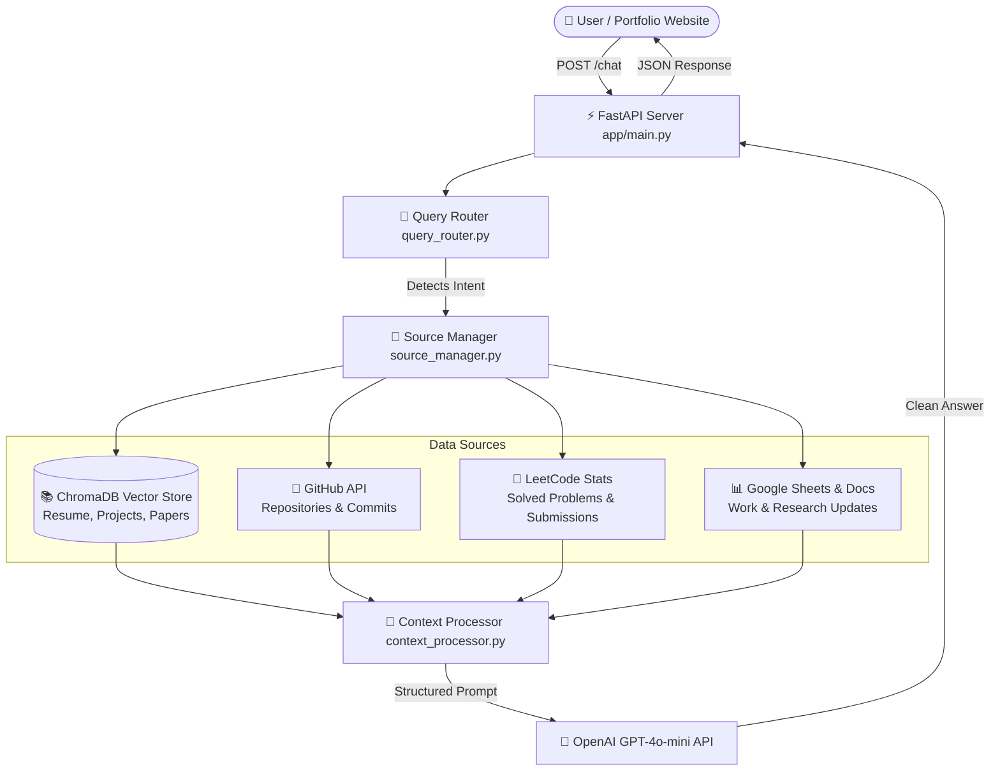

# 🤖 Personal AI Portfolio Assistant (Self-Hosted RAG)


An intelligent, low-latency **Retrieval-Augmented Generation (RAG) Portfolio Assistant** built for **Md. Asaduzzaman Shuvo**. It dynamically routes user questions across static portfolio knowledge (resume, publications, project portfolios) and live external data sources (GitHub commits, LeetCode stats, Google Sheets/Docs) to provide high-precision, hallucination-free answers.

---

## 🌟 Live Demo & API Endpoints

- **Live Service URL**: `https://myassistant-9ghz.onrender.com`
- **Interactive Swagger Docs**: [`https://myassistant-9ghz.onrender.com/docs`](https://myassistant-9ghz.onrender.com/docs)

| Method | Endpoint | Description | Sample Request |
|:-------|:---------|:------------|:---------------|
| `GET` | `/` | Root service metadata & links | *None* |
| `GET` | `/health` | API health check status | *None* |
| `POST` | `/chat` | Core RAG Chatbot Endpoint | `{"message": "Who is Shuvo?"}` |
| `GET` | `/docs` | OpenAPI / Swagger Documentation | Open in browser |
| `POST` | `/webhook` | Data synchronization trigger | Optional headers |

---

## 🏗 System Architecture

The pipeline uses intelligent multi-source query routing, vector similarity retrieval (`all-MiniLM-L6-v2`), structured context building, and guardrailed LLM inference (`GPT-4o-mini`).



---

## Key Features

- **🎯 Smart Intent Routing**:
  Uses regex word-boundary matching (`\b`) to route questions accurately to static portfolio data, GitHub commits, LeetCode stats, Google Sheets, or casual conversation without substring collision bugs.
- **⚡ Ultra-Low Memory & Fast Latency**:
  Optimized with `all-MiniLM-L6-v2` embeddings and single-threaded PyTorch execution. Operates cleanly under **~150 MB RAM** on Render's free tier with **<1s latency**.
- **🛡 Anti-Hallucination Guardrails**:
  STRICT RAG system prompts prevent fake links, invented dates, or speculative claims. If context is missing for static topics, it explicitly informs the user.
- **🔄 Recent Activity Fallback**:
  If no activity is logged specifically for *today*, the system automatically falls back to presenting recent work updates, paper acceptances, and lab awards.

---

## 📁 Repository Structure

```text
chatbotshuvo/
├── app/                        # FastAPI Web Application
│   ├── main.py                 # FastAPI Entry point & CORS configuration
│   └── routes/                 # API Route Handlers
│       ├── chat.py             # POST /chat RAG pipeline endpoint
│       ├── health.py           # GET /health endpoint
│       └── webhook.py          # POST /webhook data sync endpoint
├── data/
│   ├── chroma/                 # Pre-built ChromaDB vector database (Git-tracked)
│   ├── cleaned/                # Cleaned PDF text files
│   └── raw/                    # Cached GitHub, LeetCode & Google raw JSONs
├── scripts/                    # Core RAG Logic & Utilities
│   ├── query_router.py         # Regex Intent Router & Classifier
│   ├── source_manager.py       # Multi-source data retriever dispatcher
│   ├── retriever.py            # ChromaDB vector similarity search engine
│   ├── context_processor.py     # Prompt context builder & text cleaner
│   ├── llm_client.py           # OpenAI GPT-4o-mini API client & prompts
│   ├── create_embeddings.py    # Vector indexing script (all-MiniLM-L6-v2)
│   ├── chunk_documents.py      # Recursive document text splitter
│   └── chatbot.py              # Interactive CLI Chatbot interface
├── .env                        # Local Environment variables (ignored)
├── API_INTEGRATION_GUIDE.md    # Copy-paste guide for website frontend integration
├── render.yaml                 # Infrastructure-as-code for Render Free Tier
├── requirements.txt            # Minimal CPU-optimized Python dependencies
└── README.md                   # Project documentation
```

---

## 🛠 Local Setup & Development

### 1. Prerequisites
- Python 3.11+
- Git

### 2. Installation
```bash
# Clone repository
git clone https://github.com/ashuvo25/myAssistant.git
cd myAssistant

# Create virtual environment
python -m venv venv
source venv/bin/activate  # On Windows: .\venv\Scripts\activate

# Install CPU-optimized dependencies
pip install -r requirements.txt
```

### 3. Environment Variables
Create a `.env` file in the root directory:
```env
PORT=8000
ENVIRONMENT=development
ALLOWED_ORIGINS=http://localhost:3000,https://ashuvo25.github.io

# OpenAI Key
OPENAI_API_KEY=sk-proj-YOUR_OPENAI_API_KEY
OPENAI_MODEL=gpt-4o-mini

# GitHub & LeetCode Config
GITHUB_USERNAME=ashuvo25
GITHUB_TOKEN=github_pat_YOUR_TOKEN
LEETCODE_USERNAME=shuvo_o
```

### 4. Running the Chatbot Locally

#### **Option A: Interactive CLI Chatbot**
```bash
python scripts/chatbot.py
```

#### **Option B: FastAPI Web Server**
```bash
python -m uvicorn app.main:app --reload
```
Open **`http://localhost:8000/docs`** in your browser to test endpoints interactively.

---

## 🌐 Website Integration

To connect this AI Assistant to your portfolio website, add this lightweight floating widget script before `</body>` in your website's HTML:

```html
<script>
  async function askShuvoAI(question) {
    const res = await fetch("https://myassistant-9ghz.onrender.com/chat", {
      method: "POST",
      headers: { "Content-Type": "application/json" },
      body: JSON.stringify({ message: question })
    });
    const data = await res.json();
    return data.answer;
  }
</script>
```
*For a full HTML/CSS/JS copy-paste widget or React/Next.js hook, see [API_INTEGRATION_GUIDE.md](file:///d:/P_ort_folio/chatbotshuvo/API_INTEGRATION_GUIDE.md).*

---

## 📄 License & Credits

Developed by **Md. Asaduzzaman Shuvo** (AI Engineer & Researcher). Powered by OpenAI, ChromaDB, and FastAPI.
